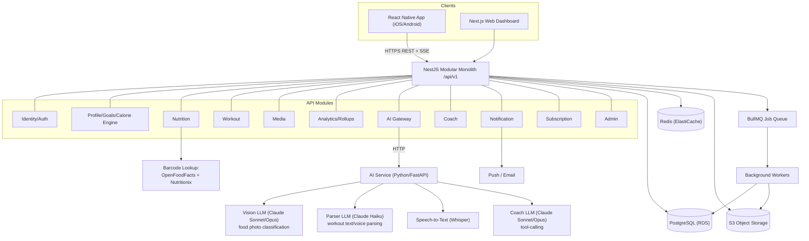
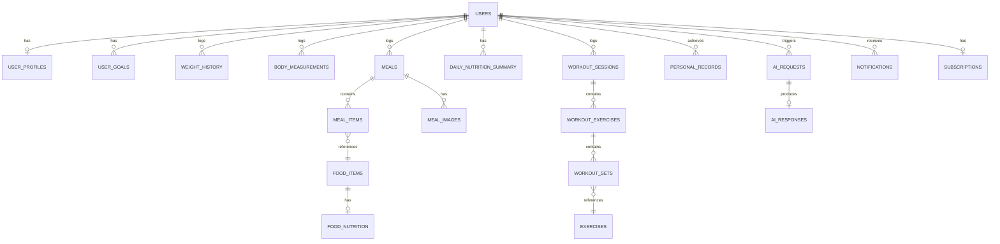

# AI Fitness & Nutrition Platform — Planning Document

## Context

You provided a detailed master requirements prompt for a production-grade, end-to-end AI fitness/nutrition platform (mobile + web + backend + AI + database), to be built from scratch — the working directory currently contains only that requirements document, no code. The explicit instruction was to produce a full architecture/product plan first and wait for "START IMPLEMENTATION" before writing any code.

Four architecture-determining questions were resolved with you before designing:
- **Market**: India-first launch (global expansion designed for, not built first)
- **Team**: Solo developer / very small team
- **MVP food AI**: Multimodal LLM vision (not a custom-trained CV model)
- **Cloud**: No vendor lock-in — picked on merit

Two deep-dive design passes were run in parallel to work out the hardest sub-problems (AI pipeline architecture, and backend/database/infrastructure architecture), and their conclusions are synthesized below alongside the product/UX/roadmap sections you asked for.

This document follows the Section A–O structure you requested.

---

## A. Product Understanding

This is an AI-first fitness and nutrition journal. The core insight: users don't want to manually enter data — they want to **show or tell the app what they did**, and have AI convert that into structured, trackable data they can correct and trust. Two primary product loops validate the whole product:

**Loop 1 — Eat**: photograph (or scan/manually log) food → AI estimates items/portions/macros → user confirms/corrects → meal logged → daily nutrition dashboard updates → weekly insights.

**Loop 2 — Workout**: log a workout (manual/text/voice) → AI structures it into sets/reps/weight → confirmed → workout history updates → progression tracked → weekly insights → informs next workout.

Everything else (AI coach, body analysis, gamification, subscriptions, admin) is built around making these two loops as frictionless and trustworthy as possible.

---

## B. Assumptions

- India-first launch: Indian food data (IFCT) and Indian-accented speech handling are first-class requirements, not edge cases; DPDP Act 2023 is the primary privacy regime to design for (GDPR-compatible patterns layered in since they overlap heavily).
- Solo/small-team execution: architecture favors a modular monolith and single cross-platform mobile codebase over microservices/native — maximize leverage, minimize ops surface.
- MVP does not need to support millions of users on day one — but the schema/rollup strategy must not require a rewrite to get there (see §F).
- AI coach is valuable but is **not** part of either core loop, so it's scoped to V1, not MVP, to keep MVP genuinely minimal.
- No existing wearable/Health integrations, payment processing, or admin panel needed for MVP — all designed for but deferred.
- "Production-grade" is interpreted as: correct, secure, observable, and extensible — not as "microservices + Kubernetes + multi-region," which would be over-engineering for this team size and stage.

---

## C. Questions (resolved / remaining)

The four architecture-blocking questions (market, team size, MVP food-AI approach, cloud provider) are resolved (see Context). Two smaller decisions are safe to make now rather than block on:

- **STT provider (Whisper vs. commercial cloud STT)**: defer to a short bake-off against real Indian-accented voice clips once voice logging is built in V1 — doesn't block MVP since MVP workout logging is text-only.
- **Subscription pricing amounts**: architecture is subscription-ready (quota/entitlement model) regardless of actual price points — pricing itself is a business decision to make closer to V1/monetization, not now.

---

## D. Recommended Tech Stack

| Layer | Recommendation | Why | Rejected alternative |
|---|---|---|---|
| Mobile | **React Native (Expo)** | One language (TypeScript) across mobile/web/backend — the single biggest leverage move for a solo/small team; mature camera, audio-recording, push, and offline-storage libraries; Expo speeds up dev/build/OTA-update loop | Flutter (excellent, but Dart forks the team's language away from the TS backend/web, losing shared types); Native iOS+Android (best performance/platform-fit, but ~2x build effort — unjustified at this team size) |
| Web | **Next.js** | Assumed by backend's shared-types design; strong for a server-rendered analytics dashboard | — |
| Backend | **Node.js + NestJS (TypeScript)**, modular monolith | NestJS's module/DI system *is* the modular-monolith boundary mechanism; shares types with web via a monorepo; mature libraries for every requirement (validation, OAuth, queues, ORM, SSE) | Python/FastAPI (better fit for the AI worker service itself, not the transactional core — no enforced module system); Java/Spring Boot (heaviest boilerplate/ops overhead, unjustified until team is 10+ engineers) |
| AI worker service | **Python/FastAPI**, called out of NestJS as an external HTTP boundary | Python's CV/ML ecosystem where it's actually needed, without hosting business/transactional logic | — |
| Database | **PostgreSQL 15+** (AWS RDS) | Relational fits transactional fitness/nutrition data; `pg_trgm` covers food/exercise search without a separate search engine | A dedicated search engine (OpenSearch) — not justified until the food catalog reaches millions of items |
| Cache | **Redis** (ElastiCache) | Rollup caching, atomic quota/rate-limit counters, BullMQ backing store, offline-sync idempotency keys | — |
| Queue | **BullMQ** (Redis-backed), in-process with the monolith | Simplest ops for MVP job volume; abstracted behind an interface so it can be swapped to SQS+worker-fleet later without touching producer code | SQS/dedicated worker fleet — premature at this scale |
| Object storage | **S3** (private, SSE-KMS) | Meal photos, processed image variants — never stored in Postgres | — |
| Cloud | **AWS** (ECS Fargate, RDS, ElastiCache, S3) | Broadest managed-service maturity for this exact workload shape; largest hiring pool | GCP (nicer Cloud Run DX, but no deciding advantage since AI provider choice is already provider-agnostic); Azure (no enterprise/MS constraint to justify it) |
| AI/LLM — vision & coach | **Claude Sonnet 5** default, escalate to **Opus 5** on low-confidence/complex queries | Strong structured-output adherence, native prompt caching, single-vendor simplicity between food-vision and coach | GPT-4V-tier / Gemini 2.x — equally valid; worth a cost/accuracy bake-off on real Indian-food photos before hard-locking in |
| AI — workout parsing | **Claude Haiku 4.5** | Narrow structured-extraction task — cheap-model routing case | — |
| Speech-to-text | **Whisper** (open/self-hostable) primary, commercial cloud STT as fallback pending bake-off | Cost-efficient; abstracted so it can be swapped | — |
| Barcode/product data | **OpenFoodFacts** primary, **Nutritionix** commercial fallback | Free + strong India/global packaged-food coverage; write-through cache builds your own catalog over time | — |
| Nutrition reference data | **IFCT 2017** (Indian foods, authoritative), **USDA FDC** (standard/generic foods), OpenFoodFacts (packaged) | IFCT is the only real source for accurate idli/dosa/sambar/dal-type data — USDA has essentially no coverage here | — |
| Auth | JWT (RS256, 15-min access) + rotating refresh tokens with reuse detection, OAuth (Google + Sign in with Apple) | Sign in with Apple is an App Store requirement once other social logins exist | — |
| Observability | OpenTelemetry → Grafana Cloud, Sentry for exceptions | Vendor-neutral instrumentation avoids lock-in; upgrade to Datadog later if budget justifies | — |
| CI/CD | GitHub Actions, Terraform (IaC) | Standard, low-overhead for this team size | — |

---

## E. System Architecture

Every AI response is validated against a JSON schema inside `AIGateway` before any other module sees it — AI output is treated as untrusted input, never a source of truth by itself.

---

## F. Database

**Key design decisions** (PostgreSQL 15+, UUIDv7 PKs everywhere — time-ordered, and critically, client-generatable *offline* for §33's offline-logging requirement):

- `daily_nutrition_summary` (PK `(user_id, summary_date)`) is upserted **synchronously in the same transaction as the meal write**, not via a background job — the arithmetic is cheap and this keeps the home dashboard always-consistent. Weekly/monthly summaries roll up from daily via a nightly job — dashboards never scan raw `nutrition_logs`.
- `meal_items` **denormalizes the nutrition values at log time** (calorie/macro snapshot) so a later admin correction to a `food_nutrition` reference row never silently rewrites historical dashboards.
- `workout_sets` denormalizes `user_id`/`exercise_id`/`performed_at` directly (highest-cardinality table in the schema) so progression/PR queries (`index (user_id, exercise_id, performed_at DESC)`) avoid a 3-table join at scale.
- `food_items`/`food_nutrition` carry `source_type ENUM('USDA','IFCT','OPENFOODFACTS','ADMIN','USER','AI_ESTIMATE')` exactly as required — every nutrition value's trust level is always visible.
- `user_goals` is append-only (new row per recalculation) so goal history is never lost; distinguishes `system_calculated` vs `user_override`.
- `personal_records` is append-only with a partial unique index enforcing one "current" PR per `(user_id, exercise_id, record_type)`.
- `ai_requests`/`ai_responses` is the audit/cost-tracking boundary — every AI call logs provider, model, tokens, cost, latency, validation status; raw payloads live in S3, not Postgres, to keep rows small.
- `audit_logs` is range-partitioned by month from day one (cheap now, high payoff as it grows forever).
- The weekly "score" (§16 of your spec) is computed with an explicit **versioned formula** (`score_formula_version` column) so future formula changes don't retroactively distort historical comparisons.

---

## G. API

Whole-API URI versioning (`/api/v1`), REST (GraphQL deferred — not justified for a small team building fixed mobile screens; reconsider only if web analytics view-variants explode in V2). Representative endpoints by resource:

| Resource | Key endpoints |
|---|---|
| Auth | `POST /auth/{register,login,refresh,logout}`, `/auth/oauth/{google,apple}` |
| Profile | `GET/PATCH /profile`, `POST /profile/onboarding`, `GET /profile/targets`, `POST /goals` |
| Nutrition | `POST /meals/analyze-image` (AI draft, not yet saved), `POST /meals` (confirmed save), `GET /foods/search`, `POST /foods/barcode/:code`, `GET /nutrition/{daily,weekly,monthly}` |
| Workout | `GET /exercises`, `POST /workouts`, `POST /workouts/parse-text`, `POST /workouts/parse-voice`, `GET /workout-plans`, `GET /personal-records` |
| Progress | `GET /progress/{weekly,monthly,range,weight-history}` |
| AI Coach | `POST /coach/chat` (SSE streamed), `GET /coach/sessions` |
| Notifications | `GET /notifications`, `PATCH /notifications/:id/read`, `PATCH /notifications/preferences` |
| Subscriptions | `GET /subscriptions/me`, `POST /subscriptions/webhook` (signature-verified) |
| Admin | `/admin/users` (minimal PII by default), `/admin/foods`, `/admin/ai-requests?status=failed`, `/admin/system-health` |

`/meals/analyze-image` returning a *draft* (not auto-saved) is the key pattern enforcing "AI estimates, user confirms" everywhere AI touches the log.

---

## H. AI Architecture

**Food photo pipeline** (MVP-simplified from the full target design — see §K):
`IMAGE → PREPROCESS → VISION LLM (whole-image, structured JSON output) → NUTRITION DB LOOKUP → MACRO CALC → CONFIDENCE SCORE → USER CONFIRMATION → MEAL LOG`. The full target pipeline (V1+) adds a dedicated CV detection/segmentation step *before* the vision-LLM call, so each food item is cropped and classified individually — this materially improves accuracy on mixed plates (a thali with idli+sambar+chutney) but is deferred past MVP since it requires real CV/ML investment your "multimodal LLM vision for MVP" decision explicitly chose to skip initially.

**Portion estimation** is always a range with a confidence band, never a bare "exact gram" claim — the UI defaults to editable standard units (piece/cup/bowl). Every user correction (item swap, quantity edit) is captured for accuracy tracking and eventual model/prompt improvement.

**Nutrition data provenance**: IFCT 2017 for Indian foods (via one-time ETL — not a live API), USDA FDC for standard/international foods, OpenFoodFacts for packaged/barcoded products (primary) with Nutritionix as commercial fallback, write-through cached into your own DB so repeat barcode scans never re-hit the external API.

**Workout text/voice parsing**: same parser code path for both inputs (voice → Whisper STT → same text parser). Claude Haiku with JSON-schema-constrained output; parsed exercise names are fuzzy-matched against the exercise dictionary; **any ambiguity (unclear weight/reps, no exercise match, low confidence) is surfaced for user confirmation — never auto-inserted.**

**AI Coach** (V1, not MVP): tool-calling architecture — the coach never receives a full data dump. It calls scoped, server-side tools (`get_nutrition_summary`, `get_workout_history`, `get_weight_trend`, `get_user_profile_and_goals`, `search_food_database`, etc.), each resolving the authenticated user server-side (never a model-settable `user_id` parameter — closes off a whole class of cross-user data leakage). Plan-saving is a separate, explicit-confirm-gated tool, mirroring the "no auto-insert on ambiguity" pattern.

**Coach safety boundaries** (liability-relevant, not UX polish): a cheap pre-classification pass tags high-risk messages (medical conditions, eating-disorder signals, severe restriction, injury, medication). Calorie-target floors are **hard-clamped in code** (not merely prompted) — e.g. never recommend below a clinically safe minimum — regardless of what the LLM would otherwise output. High-risk interactions are logged for periodic human review. General exercise substitution ("replace squats, no rack") is in-scope; diagnosis of pain/medical conditions is always deferred to a professional.

**AI Gateway**: single abstraction (`LLMProvider`/`VisionProvider`/`STTProvider`/`ProductLookupProvider` interfaces) so no provider is hardcoded. Handles model routing (cheap model for workout parsing, mid/top-tier for vision and coach with escalate-on-low-confidence), response caching (barcode lookups, prompt-cached system prompts), per-user/subscription-tier quota enforcement, cost/latency logging to `ai_requests`/`ai_responses`, retry/timeout/fallback-model chains, and mandatory schema validation of every response before it's trusted downstream.

**Estimated AI cost**: roughly **$1.50–$2.50 per active user/month** at moderate usage (2 food photos/day, ~4 workouts/week, ~5 coach messages/week), rising to **$3–$6/month** for power users. Food-photo vision calls dominate cost — this is the primary lever for free-tier quota limits.

---

## I. Mobile UX

Rather than mirroring the spec's suggested tab list literally (it explicitly invites reconsideration), navigation is organized around the "minimize manual entry" principle: a single central **Log** action (camera / voice / barcode / manual, for both food and workouts) instead of separate deep flows buried in separate tabs.

**Bottom navigation**: `Home` · `Progress` · `[+ Log]` (central, prominent) · `Coach` · `Profile`.

- **Home**: today's calories consumed/remaining, macro rings (protein/carb/fat/fiber/water vs target), today's meals list, "did I work out today" status, one clear next action.
- **Log** (action sheet, not a full screen): Take Photo · Scan Barcode · Search/Manual Food · Log Workout (manual/text/voice).
- **Progress**: daily → weekly → monthly → long-term (90d/6mo/1yr) tabs; weight line chart, calorie bar chart, macro target-vs-actual, workout volume line chart, workout-consistency calendar heatmap, macro-distribution donut, current-vs-previous-week comparison.
- **Coach**: chat interface (V1).
- **Profile**: goals, body measurements, settings, notification preferences, subscription, data export/delete.

Onboarding is progressive (per your explicit instruction not to front-load 30 questions): account → basic info (name, DOB, gender, height/weight) → goal selection → activity level/equipment/frequency → dietary preferences/allergies (optional, skippable) → calculated targets shown immediately as the reward for completing it.

---

## J. Web UX

Web is the **review/analytics surface**, not a mobile-feature mirror — no camera-first logging duplicated here.

- Login/Dashboard (weekly overview + trend charts)
- Nutrition analytics (deeper history/filtering than mobile)
- Workout analytics (progression, volume, PRs over time)
- Long-term progress/reports (90d/6mo/1yr, exportable)
- AI Coach (same chat, larger-screen convenience)
- Profile/Goals/Settings/Subscription

Manual food/workout entry is supported on web for convenience, but photo/voice capture stays mobile-only (camera/mic UX is native-first).

---

## K. MVP

MVP validates the two core loops only — everything else is explicitly deferred:

**MVP** (must-build): auth + progressive onboarding, BMI/BMR/TDEE/macro calorie engine, manual food logging + custom foods/meals, **single-pass vision-LLM food photo logging** (no CV detection/segmentation step yet), barcode scanning, daily nutrition dashboard, basic manual + **text-only** workout logging (voice deferred), exercise library, daily/weekly workout history, basic weekly summary, essential notifications (meal/workout reminders), account deletion/export.

**V1**: voice workout logging, AI fitness coach (with full safety layer), hybrid CV+vision-LLM food pipeline upgrade, AI-generated workout plans, full weekly score/dashboard, web dashboard, long-term (90d–1yr) progress views.

**V2**: subscriptions/monetization enforcement, full admin panel, body composition/measurements analytics, gamification (streaks/badges), custom recipe builder polish.

**Future** (explicitly not prioritized): wearable/Health integrations, social/community, trainer marketplace, restaurant menu analysis, grocery lists.

---

## L. Roadmap

| Phase | Scope |
|---|---|
| 0 | Repo scaffold, CI/CD skeleton, Terraform base infra, DB schema v1 migration |
| 1 | Auth + progressive onboarding |
| 2 | Profile + calorie/macro engine |
| 3 | Manual food logging + custom foods/meals + barcode scanning |
| 4 | AI food photo recognition (single-pass vision LLM) + correction UI |
| 5 | Daily nutrition dashboard |
| 6 | Workout logging (manual + text parsing) + exercise library |
| 7 | Basic weekly summary (nutrition + workout) |
| 8 | **MVP complete** — internal/beta test against the two core loops |
| 9 | Voice workout logging + AI coach (with safety layer) |
| 10 | Web dashboard |
| 11 | Hybrid CV food pipeline upgrade, AI-generated workout plans, full weekly score |
| 12 | Subscriptions, admin panel, production hardening |

---

## M. Risks

- **AI portion-estimation accuracy**: no ground-truth weight sensor; real error margin on irregular/stacked foods — mitigated by always presenting a range + trivially-easy correction, never an "exact" claim.
- **Indian mixed-dish variance**: regional recipe variation (e.g. Tamil vs. Andhra sambar) isn't fully resolved by any CV/LLM combination — mitigated but not eliminated by regional DB variants and correction-driven refinement.
- **STT accuracy on Indian-accented speech**: known weak spot for generic STT — bake-off before committing to voice logging in V1; never auto-commit a low-confidence transcript.
- **Coach safety/liability**: health-adjacent product — hard-coded calorie floors and a clinical/nutrition-advisor review of actual refusal templates before V1 coach launch is a real requirement, not optional polish.
- **Packaged-food catalog gaps**: OpenFoodFacts coverage for smaller regional Indian brands will have real gaps initially — expect a non-trivial "not found" rate at launch, closing over time via the admin backfill queue and user-contributed entries.
- **Solo/small-team bandwidth**: the full spec (§1–56) is a multi-year enterprise scope if built literally — the MVP/roadmap split above is the primary mitigation; resist scope creep back toward the full spec before MVP validates the two loops.
- **App Store requirements**: Sign in with Apple is mandatory once other social logins exist; camera/microphone permission justifications and health-adjacent data handling will get extra App Store review scrutiny — budget time for this.
- **AI vendor drift**: hosted model updates can silently shift behavior even at a stable API version — maintain an eval set from real user corrections and re-run it on model/version bumps.
- **Cost risk**: AI vision cost dominates spend well before infra cost does — the gateway's per-tier quota enforcement is the control valve; must ship before any real user growth, not added later.

---

## N. Cost

**AI cost**: ~$1.50–$2.50/active user/month at moderate usage, $3–$6/month for power users (see §H) — track live via the `ai_requests`/`ai_responses` usage ledger and gate per subscription tier from day one.

**Infra cost** (AWS, excludes AI token cost):

| MAU | Approx. monthly infra |
|---|---|
| 1,000 | $150–300 |
| 10,000 | $800–1,500 |
| 100,000 | $4,000–8,000 |

**Development time**: for a solo/small team building the MVP scope in §K (not the full 56-section spec), expect roughly **3–4 months** to a testable MVP, assuming Claude Code-assisted implementation and no dedicated ML/data-engineering hire (the IFCT/USDA/OpenFoodFacts ETL is the most likely underestimated task — budget real time for nutrition-data cleanup).

---

## O. Final Recommendation

Build a **modular monolith** (NestJS/TypeScript) on **PostgreSQL + Redis + S3 on AWS**, with a **React Native (Expo)** mobile app and **Next.js** web dashboard sharing types through a monorepo — this maximizes a solo/small team's leverage while keeping clean extraction seams (already-external AI service, module-per-domain boundaries) if the team or scale grows later. Route all AI calls through a single provider-agnostic **AI Gateway** so no vendor is hardcoded, defaulting to **Claude Sonnet 5** for vision/coach and **Haiku 4.5** for workout parsing.

Scope the **MVP tightly to the two core loops** (Eat, Workout) using the **simplest viable AI approach per loop** — single-pass vision-LLM food recognition (not a full CV pipeline) and text-only workout parsing (voice deferred) — explicitly deferring the AI coach, hybrid CV pipeline, subscriptions, and admin panel to V1/V2. This keeps the MVP buildable in months rather than years while validating the product's actual differentiator (AI converts real-world behavior into structured fitness data) before investing in the harder/more expensive refinements the full spec envisions.
